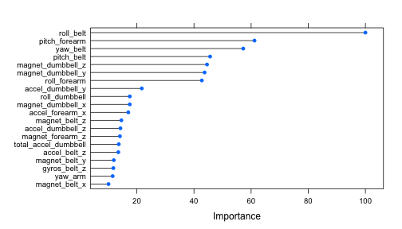
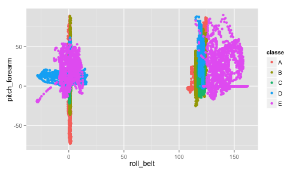

Predicting Barbell Technique from Accelerometer Data
========================================================

## Executive Summary

This report describes the development, evaluation, and application of a machine
learning model to predict barbell lifting techniques based on accelerometer data
from a study on *Qualitative Activity Recognition of Weight Lifting Exercises*
(more details [here](http://groupware.les.inf.puc-rio.br/work.jsf?p1=11201)).

The final model selected is a random forest model based on 52 features of the
original data set. The model is able predict the training and test set
techniques with 100% accuracy, and has an expected out-of-sample error rate of
0.44%.

## Data Preparation

First, I load the Caret package.


```r
library(caret)
```

```
## Loading required package: lattice
## Loading required package: ggplot2
```


I then read the training and test data sets into R, and perform some
pre-processing on the training set. Specifically, I removed all features that
have NA or missing values, or do not appear to be direct readings from activity
sensors. This results in a data frame with 53 variables, which I used for model
training.


```r
trainRaw <- read.csv("data/pml-training.csv", na.strings = c("", "NA", "#DIV/0!"))
test <- read.csv("data/pml-testing.csv", na.strings = c("", "NA", "#DIV/0!"))
naCounts <- apply(trainRaw, 2, function(x) {
    sum(is.na(x))
})
removeCols <- c("X", "user_name", "raw_timestamp_part_1", "raw_timestamp_part_2", 
    "cvtd_timestamp", "new_window", "num_window")
keepCols <- setdiff(names(naCounts[naCounts == 0]), removeCols)
train <- trainRaw[, keepCols]
```


## Model Development

Given the large number of variables in the resulting data set and the five-level
factor nature of the outcome, I limited the set of possible model-building
methods to a few that include built-in feature selection and can handle
predicting factor outcomes with more than two levels. I built a model
using each of the following three methods:

* Tree (using rpart)
* Random Forest (using randomForest)
* Boosting (using gbm)

Within each model, I chose to use 4-fold cross-validation. This was done in
order to perform a sufficient amount of cross-validation, while maintaining a
reasonable processing time.

The development and evaluation of each model is discussed below.

### Tree Model

Using the Caret package, I fit a tree model to the training set, use the model
to predict training set outcomes, and display the associated Confusion Matrix
and various statistics below.


```r
set.seed(1212)
mod_tree <- train(classe ~ ., data = train, method = "rpart", trControl = trainControl(method = "cv", 
    number = 4))
```

```
## Loading required package: rpart
```

```r
prTrainMod_tree <- predict(mod_tree, train)
confusionMatrix(prTrainMod_tree, train$classe)
```

```
## Confusion Matrix and Statistics
## 
##           Reference
## Prediction    A    B    C    D    E
##          A 5080 1581 1587 1449  524
##          B   81 1286  108  568  486
##          C  405  930 1727 1199  966
##          D    0    0    0    0    0
##          E   14    0    0    0 1631
## 
## Overall Statistics
##                                         
##                Accuracy : 0.496         
##                  95% CI : (0.489, 0.503)
##     No Information Rate : 0.284         
##     P-Value [Acc > NIR] : <2e-16        
##                                         
##                   Kappa : 0.341         
##  Mcnemar's Test P-Value : NA            
## 
## Statistics by Class:
## 
##                      Class: A Class: B Class: C Class: D Class: E
## Sensitivity             0.910   0.3387    0.505    0.000   0.4522
## Specificity             0.634   0.9215    0.784    1.000   0.9991
## Pos Pred Value          0.497   0.5085    0.330      NaN   0.9915
## Neg Pred Value          0.947   0.8531    0.882    0.836   0.8901
## Prevalence              0.284   0.1935    0.174    0.164   0.1838
## Detection Rate          0.259   0.0655    0.088    0.000   0.0831
## Detection Prevalence    0.521   0.1289    0.266    0.000   0.0838
## Balanced Accuracy       0.772   0.6301    0.644    0.500   0.7257
```

```r
acc_tree = confusionMatrix(prTrainMod_tree, train$classe)$overall[1]
```


While the estimation of the tree model is extremely quick, we can see from the
output of the confusionMatrix function that the accuracy is only
0.496. This will clearly not be sufficient to predict the
techniques in the test set with a reasonable degree of reliability.

### Random Forest Model

Using the Caret package, I fit a random forest model to the training set, use
the model to predict training set outcomes, and display the associated Confusion
Matrix and various statistics below.


```r
set.seed(465)
mod_rf <- train(classe ~ ., data = train, method = "rf", trControl = trainControl(method = "cv", 
    number = 4))
```

```
## Loading required package: randomForest
## randomForest 4.6-7
## Type rfNews() to see new features/changes/bug fixes.
```

```r
prTrainMod_rf <- predict(mod_rf, train)
confusionMatrix(prTrainMod_rf, train$classe)
```

```
## Confusion Matrix and Statistics
## 
##           Reference
## Prediction    A    B    C    D    E
##          A 5580    0    0    0    0
##          B    0 3797    0    0    0
##          C    0    0 3422    0    0
##          D    0    0    0 3216    0
##          E    0    0    0    0 3607
## 
## Overall Statistics
##                                 
##                Accuracy : 1     
##                  95% CI : (1, 1)
##     No Information Rate : 0.284 
##     P-Value [Acc > NIR] : <2e-16
##                                 
##                   Kappa : 1     
##  Mcnemar's Test P-Value : NA    
## 
## Statistics by Class:
## 
##                      Class: A Class: B Class: C Class: D Class: E
## Sensitivity             1.000    1.000    1.000    1.000    1.000
## Specificity             1.000    1.000    1.000    1.000    1.000
## Pos Pred Value          1.000    1.000    1.000    1.000    1.000
## Neg Pred Value          1.000    1.000    1.000    1.000    1.000
## Prevalence              0.284    0.194    0.174    0.164    0.184
## Detection Rate          0.284    0.194    0.174    0.164    0.184
## Detection Prevalence    0.284    0.194    0.174    0.164    0.184
## Balanced Accuracy       1.000    1.000    1.000    1.000    1.000
```

```r
acc_rf = confusionMatrix(prTrainMod_rf, train$classe)$overall[1]
```


In contrast with the tree model above, the random forest model takes
significantly longer to estimate, but is able to provide 100% accuracy
predicting on the training set.

### Boosting Model

Using the Caret package, I fit a boosting model to the training set, use the
model to predict training set outcomes, and display the associated Confusion
Matrix and various statistics below.


```r
set.seed(8992)
mod_boost <- train(classe ~ ., data = train, method = "gbm", verbose = FALSE, 
    trControl = trainControl(method = "cv", number = 4))
```

```
## Loading required package: gbm
## Loading required package: survival
## Loading required package: splines
## 
## Attaching package: 'survival'
## 
## The following object is masked from 'package:caret':
## 
##     cluster
## 
## Loading required package: parallel
## Loaded gbm 2.1
## Loading required package: plyr
```

```r
prTrainMod_boost <- predict(mod_boost, train)
confusionMatrix(prTrainMod_boost, train$classe)
```

```
## Confusion Matrix and Statistics
## 
##           Reference
## Prediction    A    B    C    D    E
##          A 5512   92    0    3    4
##          B   49 3631   80    5   22
##          C    9   72 3301   86   24
##          D    8    2   37 3108   31
##          E    2    0    4   14 3526
## 
## Overall Statistics
##                                        
##                Accuracy : 0.972        
##                  95% CI : (0.97, 0.975)
##     No Information Rate : 0.284        
##     P-Value [Acc > NIR] : < 2e-16      
##                                        
##                   Kappa : 0.965        
##  Mcnemar's Test P-Value : 8.5e-15      
## 
## Statistics by Class:
## 
##                      Class: A Class: B Class: C Class: D Class: E
## Sensitivity             0.988    0.956    0.965    0.966    0.978
## Specificity             0.993    0.990    0.988    0.995    0.999
## Pos Pred Value          0.982    0.959    0.945    0.976    0.994
## Neg Pred Value          0.995    0.990    0.992    0.993    0.995
## Prevalence              0.284    0.194    0.174    0.164    0.184
## Detection Rate          0.281    0.185    0.168    0.158    0.180
## Detection Prevalence    0.286    0.193    0.178    0.162    0.181
## Balanced Accuracy       0.990    0.973    0.976    0.981    0.988
```

```r
acc_boost = confusionMatrix(prTrainMod_boost, train$classe)$overall[1]
```


The boosting model provides a level of training set prediction accuracy
(0.972) much higher than the tree model, but obviously lower
than that of the random forest model.

## Final Model Selection and Evaluation

Due to the superior level of accuracy, and its comparable estimation time to
that of the boosting model, I chose to examine the random forest model in more
detail, with the intent to use it as my final model barring any fatal flaws.

First, I retrieve the estimated out-of-sample error rate from the model object.


```r
oos_error <- mod_rf$finalModel$err.rate[nrow(mod_rf$finalModel$err.rate), "OOB"]
```


The out-of-sample error rate is a quite satisfactory
0.0044%.

Next, I check to see which variables have the most importance, and create a
plot.


```r
rfImp <- varImp(mod_rf)
```

```
## Loading required package: randomForest
## randomForest 4.6-7
## Type rfNews() to see new features/changes/bug fixes.
```

```r
plot(rfImp, top = 20)
```

 


Since it's difficult to visually examine data with this many features, I
visualize the data based on technique and the two most important variables
determined above: roll_belt and pitch_forearm. Roll_belt and pitch_forearm are
plotted on the x and y axes, respectively, while the color of the points
indicates the lifting technique.


```r
p <- qplot(roll_belt, pitch_forearm, col = classe, data = train)
print(p)
```

 


Looking at the plot, there clearly is a high degree of clustering, even when
using only two predictors.

## Test Set Prediction

Seeing no reason not to use the random forest model, I use it to predict barbell
technique on the test set.


```r
predict(mod_rf, test)
```

```
##  [1] B A B A A E D B A A B C B A E E A B B B
## Levels: A B C D E
```


The model was able to successfully predict the technique for each of the twenty
test set observations.
